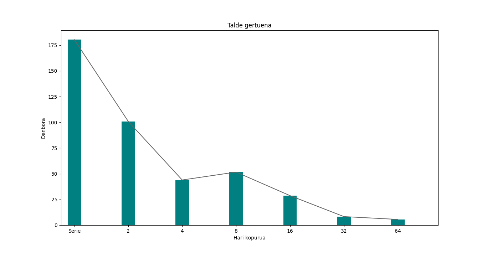
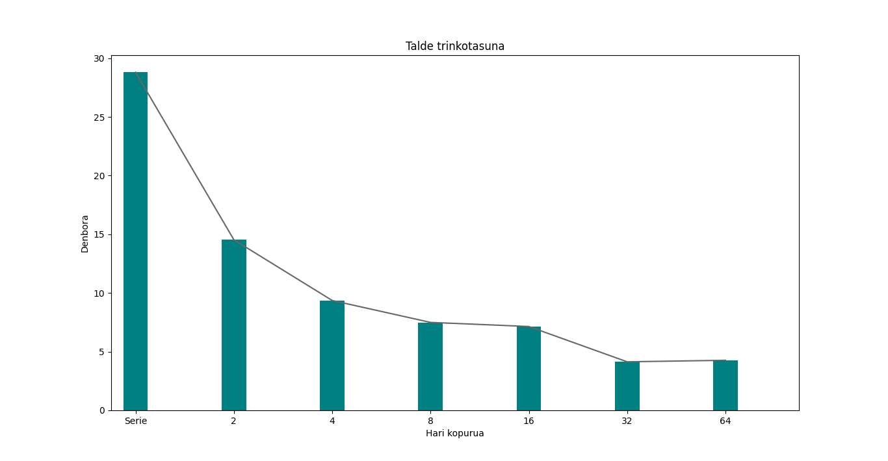
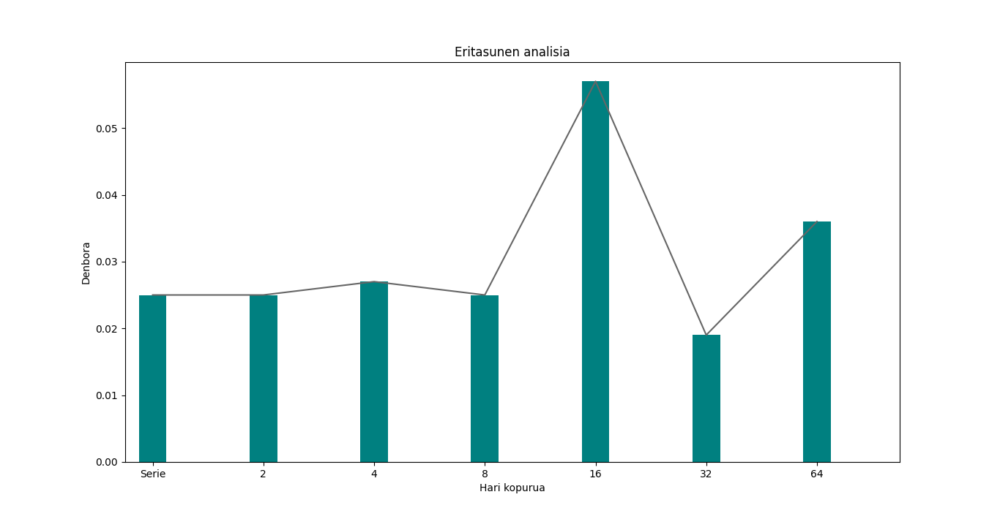

<h1 align = "center"> Txosten Teknikoa </h1>
<h2 align = "center"> Eritasunen analisi genetikoa </h2>
<h4 align = "right"> Julen Ortiz eta Jon Ander Blanco </h4>

## Edukien taula:

* [Sarrera:](#sarrera)    2
* [Patogenoen laginen analisi genetikoa](#patogenoen-laginen-analisi-genetikoa):    2
* [Hardware ezaugarriak:](#hardware-ezaugarriak)    2
* [Software ezaugarriak:](#software-ezaugarriak)    3
* [Oinarri Teorikoak:](#Oinarri-teorikoak)    3
* [Aplikazioak:](#aplikazioak)    4
* [Ondorioak:](#ondorioak)    6
* [Bibliografia:](#bibliografia)    7

## Sarrera:

### Patogenoen laginen analisi genetikoa:

Ikerketa proiektu honetan, hainbat azterketa genetiko mota egiten ditu, gaur egungo COVID-19 bezalako eritasunei aurre egiteko, patogenoen analisi genetikoa eginez. Analisi hauek egin ahal izateko, datu genetikoak gordetzen dituen eta eritasunen garatzeko probabilitateak dituen fitxategiekin lan egiten da. Fitxategi hauek prozesatuz eritasunei buruzko informazioa eta datuak lortzen dira.

Datu genetikoak dauden fitxategian, 200.000 lagin baino gehio aurki ditzazkegu eta lagin bakoitzean beste 40 datu (0tik-100era). Datu guzti hauek, K-means algoritmoa erabiliz sailkatzen dira 100 taldetan haien ezaugarrien arabera. Sailkapen algoritmo honek, n elementu k taldeetan sailkatzen ditu non elementu bakoitza taldeko batez-bestearekiko gertuena dena.

Taldeen sailkapena egin ondoren, talde bakoitzaren trinkotasuna kalkulatzen da, eta azkenik, talde bakoitzaren laginen infekzioei buruzko informazioa lortu eta prozesatzen da (Haien maximoak eta minimoak lortzen dira, haien taldea barne).

### Hardware ezaugarriak:

* PowerEdge R740 (DELL)
* 2 Intel Xeon Gold 6130 prozesadore, 16 nukleo - 2,1 GHz
* 32 GB RAM (RDIMM - 2666 MT/s)
* NVIDIA QUADRO P4000 (GPU) 

### Software ezaugarriak:

* Sistema eragilea: “Linux”
* Erabilitako programazio lengoaiak: “C”, “Python”
* Python-eko liburutegiak: “mathplotlib”, “numpy”
* C-ren konpiladorea “GNU compiler collection (gcc)”
* Fitxategiak editatzeko erabilitako textu-editoreak: “nano” eta “vim”
* PDF egiteko eta konpilatzeko programak: “Drive” eta “Pandoc”
* Paralelizatzeko erabilitako API-a: “OpenMP”

## Oinarri Teorikoak:
Programen exekuzio denborak txikitu ahal izateko, hainbat estrategia edo metodo erabili ditzazkegu, hala nola: segmentazioa, algoritmo optimoagoak erabiltzea, konpliazioa optimizatzea, hardwarea hobetzea, etab… Baino guk, konpiladorearen optimizazioak erabili eta programaren funtzio batzuk paralelizatu ditugu. Honela lan karga prozesadorearen nukleo desberdinen artean banatzeko.

Gure kasuan, ez dugu programa osoa paralelizatu, planteatuta zeuden eta egindako funtzioak baizik (“talde_gertuena”, “talde_trinkotasuna”, “eritasun_analisia”). Lanaren banaketa modu desberdinetan egin daiteke, lana estatikoki banatu daiteke eta programa exekutatu baino lehen erabakitzen da hari bakoitzak zer lan egin behar duen. Hau egin daiteke lana lehenagotik badakiguenean zenbateakoa izango den eta hari bakoitza gutxi-gora batera bukatuko dutenean.

Lanaren denbora jakin ezin dugunean, hau dinamikoki banatzen da, eta exekuzio denboran lanaren banaketa aldatzen da. Lana estatikoki banatuko bagenu posiblea izango litzateke thread batek lan erraza edukitzea eta azkar bukatzea, baino beste batek asko irautea. Honek dakar hari guztiek azkenari itxarotea eta programaren abiadura motetzea. Hau ekiditeko hasieran thread bakoitzak lan asko hartzen du eta bukaerarantz bakoitzak gutxiago, honela hari azkarrenaren eta motelaren denbora minimizatzen da.

Nahiz eta paralelizazioa oso tresna erabilgarria den, ezin da beti erabili. Kasu batzuetan lana banaka egin behar da eta ezinezkoa edo ez da komenigarria paralelizatzea. Adibidez lan honetan zentroideak “ausaz” sortzen dira baina hauek sortzeko seed bat erabiltzen da. Honek beti balio segida berdina emango du exekuziotik-exekuziora. Hau erabilita ehungarren bailioa zein den lortu ahal izateko beste 99 balioetatik pasa behar da eta orduan ez du zentzurik paralelizatzea. Ezinezkoa da hari batek lehenengo 50 balioak sortzea, beste batek gelditzen diren 50 sortzen dituen bitartean, hasierakoen balioa behar delako.

Beste kasu batzuetan paralelizatzea posiblea da baino lana banatzea eta kalkulua egitea paraleloan, seriean egitea baino gehiago kostatzen du. Adibidez 100 elementuko lista bateko elementu bakoitzari bat gehitzea oso azkarra da eta azkarrago exekutatuko da serien, paraleloan baino hariak hasieratzeak denbora behar duelako.


## Aplikazioak:

### Seriean:

Programaren hasieran bi fitxategiak kargatzen dira memoriara eta 100 zentroide sortzen dira ausaz. Ondoren elementuak zentroide hauen inguruan taldekatu behar dira, horretarako elementu bakoitzaren zentroide hurbilena kalkulatu behar da. Honetarako bi zuntzio erabiltzen dira: distantzia_genetikoa eta talde_gertuena.

Honetarako talde_gertuena talde gertuena funtzioa erabiltzen da, honek elementu bakoitza artu eta zentroide guztientatik gertuena bilatu eta sailka listan zentroidearen indizea gordetzen du.


```
void talde_gertuena(int elekop, float elem[][ALDAKOP], float zent[][ALDAKOP], int *sailka) {
    double dg, dg_min;
    int pos;

  for (int i = 0; i < elekop; i++) {
    dg_min = DBL_MAX;
    pos = 0;
    for (int j = 0; j < TALDEKOP; j++) {
      dg = distantzia_genetikoa(&elem[i][0], &zent[j][0]);
      if (dg_min > dg) {
        dg_min = dg;
         pos = j;
      }
    }
    sailka[i] = pos;
  }
}
```

Bi puntuen arteko distantzia kalkulatzeko distantzia_genetikoa funtzioa erabiltzen da eta izenak esaten duen bezela bi puntuen distantzia kalkulatzen du eta horretarako distatzia euklidestarra erabiltzen da. Algoritmo honek edozein dimentsiotan lan egin dezakeenez ez dago erazorik gure 40 dimenstioko puntuekin. Distantzia euklidestarra honela definitzen da:

$d(p,q) = \sqrt{(p_1- q_1)^2 + (p_2 - q_2)^2+\cdots+(p_i - q_i)^2+\cdots+(p_n - q_n)^2}$

```
double distantzia_genetikoa(float *elem1, float *elem2) {
    double dist = 0;

    for (int i = 0; i < ALDAKOP; i++) {
            dist += pow((double) (elem1[i] - elem2[i]), 2);
    }

    return sqrt(dist);
}
```

Taldeak sailkatu ondoren, hauen trinkotasuna kalkulatzen da, trinkotasuna, talde bakoitzaren elementuen arteko batez-besteko distantzia da. Zentroideen posizioak balio hauen arabera aldatzen dira. Hau egin ondoren berriro kalkulatzen dira talde gertuenak. Hau hainbat aldiz egin behar da, prozesua zentroideen posizio 0.01-eko edo gutxiagoa denean edo prozesu hay 1000 aldiz egin ondoren gelditzen da.
Talde trinkotasuna honela kalkulatzen da:

```
void talde_trinkotasuna(float elem[][ALDAKOP], struct tinfo *kideak, float *trinko) {
    double bataz_bestekoa = 0;
    int kont;
    for (int i = 0; i < TALDEKOP; i++) {
      if (kideak[i].kop <= 1) {
          trinko[i] = (float) 0.000;
      } else  {
        for (int j = 0; j < kideak[i].kop; j++){
          for (int j = 0; j < kideak[i].kop; j++){
              kont++;
              bataz_bestekoa += distantzia_genetikoa(&elem[kideak[i].osagaiak[j][0],&elem[kideak[i].osagaiak[k][0]);
          }
        }
        trinko[i] = (float) (bataz_bestekoa / kont);
      }
    }
}
```

Bukatzeko, eritasun guztiei buruz datauk lortzen dira. Talde bakoitzeko hauen batez-besteko presentzia neurtu behar da, haien maximo eta minimoekin (baita ere zein taldetan ematen diren maximo eta minimo horiek).


```
void eritasunen_analisia(struct tinfo *kideak, float eri[][ERIMOTA], struct analisia *eripro) {

  float bataz_bestekoa;

  for(int i = 0; i < ERIMOTA; i++) {
    eripro[i].min = DBL_MAX;
    eripro[i].max = DBL_MIN;
    for (int j = 0; j < TALDEKOP; j++) {
      bataz_bestekoa = 0;
        for (int k = 0; k < kideak[j].kop; k++){
          bataz_bestekoa += eri[kideak[j].osagaiak[k]][i];
    }
    bataz_bestekoa = bataz_bestekoa / (float) kideak[j].kop;
      if (bataz_bestekoa > eripro[i].max) {
          eripro[i].max = bataz_bestekoa;
          eripro[i].tmax = j;
      } else if (batez_bestekoa < eripro[i].min) {
        eripro[i].min = bataz_bestekoa;
        eripro[i].tmin = j;
      }
    }
  }
}
```

### Paraleloan:

Gure kasuan funtzio guztiak paraelizatu beharrean hiru hauek (distantzia_genetikoa, talde_gertuena eta talde_trinkotasuna) aukeratu ditugu konputazionalki gehien eskatzen dutenak direlako. Hauek paralelizatzea izango da programaren exekuzio denborak gehien aldatuko dituenak. Horretaz aparte main-eko parte batzuk ezin dira paralelizatu, hauek fitxategitik erakurri edo idatzi eta zentroideen sorketa dira.

**distantzia_genetikoa** - Funtzioa hau ez dugu paralelizatu. Funtzio hau paralelizatuz gero, beste funtzioetan erabiltzen denez eta hauek paralelizatuta daudenez, hari bakoitzak hari gehiago sortuko lituzke. Adibidez talde_gertuena exekutatzerakoan 64 hariekin, hari bakoitzak beste 64 hari sortuko lituzke distantzia_genetikoa deitzean. Hariak sortzea denbora dakar eta kasu honetan serien exekutatzea baino denbora gehiago da.

**talde_gertuena** - Funtzio honetan , “parallel for” erabili dugu. Kasu honetan “schedule(static, 1)”  erabiltzea aukeratu dugu. Exekuzio denbora konstantea denez, komenigarriagoa da “static” erabiltzea. “elekop, elem, zent, sailka” aldagaiak “shared” bezala jarri ditugu ematen dizkiguten bektore edo atributuak direlako eta komeni zaigu balioak mantentzea. Azkenik, “dg, dg_min eta pos” private bezala jarri ditugu loop bakoitzean balio bakarra eta berria erabiltzen direlako (distantzia eta minimoa).

```
void talde_gertuena(int elekop, float elem[][ALDAKOP], float zent[][ALDAKOP], int *sailka) {
    double dg, dg_min;
    int pos;

#pragma omp parallel for shared(elekop, elem, zent, sailka) private(dg, dg_min, pos) schedule(static, 1)

    for (int i = 0; i < elekop; i++) {
            dg_min = DBL_MAX;
            pos = 0;
            for (int j = 0; j < TALDEKOP; j++) {
                    dg = distantzia_genetikoa(&elem[i][0], &zent[j][0]);
                    if (dg_min > dg) {
                        dg_min = dg;
                        pos = j;
                    }
            }
        sailka[i] = pos;
    }
}
```



**talde_trinkotasuna** - Funtzio honetan ere “parallel for”-ez baliatu gara paralelizatzeko. Kasu honetan bestean ez bezala, “schedule(dynamic)” erabili dugu. Ez dakigunez zenbat kostatuko zaion exekutatzea funtzioari, komenigarriagoa da “static” erabiltzea, kasu honetan talde bakoitzean ez dakigunez zenbat elementu dauden, hasierako eta bukaerako harien artean diferentzia handia egonez gero, exekuzio denbora handitzen da. Funtzio honetan “reduction(+:bataz_bestekoa)” erabili dugu, “bataz_bestekoa” aldagaian loop bakoitzean zerbait gehitzen zaiolako. “kont” aldagaia loop bakoitzean balio berria duenez, “private” jartzea erabaki dugu. Azkenik, “elem, kideak eta trinko” bektoreak eta matrizeak behin eta berriro horietatik irakurtzen eta lan egiten ari garenez, “shared” bezala jarri behar dira.

```
void talde_trinkotasuna(float elem[][ALDAKOP], struct tinfo *kideak, float *trinko) {
    double bataz_bestekoa = 0;
    int kont;

    #pragma omp parallel for shared(elem, kideak, trinko) private(kont) reduction(+:batez_bestekoa) schedule(dynamic)

    for (int i = 0; i < TALDEKOP; i++) {
        if (kideak[i].kop <= 1) {
            trinko[i] = (float) 0.000;
        } else  {
            for (int j = 0; j < kideak[i].kop; j++){
                for (int j = 0; j < kideak[i].kop; j++){
                    kont++;
                    bataz_bestekoa += distantzia_genetikoa(&elem[kideak[i].osagaiak[j][0],&elem[kideak[i].osagaiak[k][0]);
                }
            }
        trinko[i] = (float) (bataz_bestekoa / kont);
        }
    }
}
```



**eritasunen_analisia** - Azken funtzio honetan ere “parallel for”-ez baliatu gara paralelizatzeko. talde_trinkotasuna funtzioan bezala, “schedule(dynamic)” erabili dugu, ez dakigunez zenbat kostatuko zaion exekutatzea funtzioari, kasu honetan ere lehen aipatu dugun bezala, ez dakigu bektore eta matrizeen elementuen tamaina, beraz lehen eta azken hariren arteko diferentzia handia izanez gero denbora galduko zen exekuzioan. Funtzio honetan ere “reduction(+:bataz_bestekoa)” erabili dugu, “bataz_bestekoa” aldagaian loop bakoitzean zerbait gehitzen zaiolako. Azkenik, “eri, kideak eta eripro” bektoreak eta matrizeak behin eta berriro horietatik irakurtzen eta datuak gordetzen ari garenez, “shared” bezala jarri behar dira.

```
void eritasunen_analisia(struct tinfo *kideak, float eri[][ERIMOTA], struct analisia *eripro) {

    float bataz_bestekoa;

    #pragma omp parallel for shared(kideak, eri, eripro) reduction(+:batez_bestekoa) schedule(dynamic)

    for(int i = 0; i < ERIMOTA; i++) {
        eripro[i].min = DBL_MAX;
        eripro[i].max = DBL_MIN;
        for (int j = 0; j < TALDEKOP; j++) {
            bataz_bestekoa = 0;
            for (int k = 0; k < kideak[j].kop; k++){
                bataz_bestekoa += eri[kideak[j].osagaiak[k]][i];
            }
            bataz_bestekoa = bataz_bestekoa / (float) kideak[j].kop;
            if (bataz_bestekoa > eripro[i].max) {
                eripro[i].max = bataz_bestekoa;
                eripro[i].tmax = j;
            } else if (batez_bestekoa < eripro[i].min) {
                eripro[i].min = bataz_bestekoa;
                eripro[i].tmin = j;
            }
        }
    }
}
```



## Ondorioak:

* Programa exekutatu ondoren ikusten da, seriean paraleloan baino askoz denbora gehiago kostatzen zaiola exekutatzea. Seriean exekutatzerakoan 214 segundu inguru kostatzen zaio, eta paraleloan berriz, lortu dugun exekuzio azkarrena 15 segundu ingurukoa da 32 harirekin (64 harirekin probatu ondoren 13-14 segundu inguru kostatzen zitzaion. Beraz diferentzia handia dago bien artean. Hasieran 2 harirekin exekutatu ondoren, diferentzia ikaragarria ere ikusten da seriearekin konparatuz  eta hariak handitu ahala exekuzio denbora gero eta txikiagoa da, 8 harirekin ez ezik. 8 harirekin exekutatzerakoan ikusi dugu 4 harirekin baino denbora gehiago kostatzen zaiola baino gero 16 harirekin denbora gutxiago kostatzen zaio. Aipatzekoa da ere bai, goian grafikoetan ikusten denez, taldeak sailkatzen dituen funtzioak programan exekutatzen gehien kostatzen zaion zatia da, eta exekuzio denboraren zati gehiena da.

* Azelerazio-faktoreen aldetik ikusi dezakegu geroz eta hari gehiagorekin exekutatu, orduan eta azelerazio faktorea handiago, 8 harirekin ez ezik. 32 hari erabilita, ikusi dezakegu diferentzia handia dagoela beste kasuekin konparatuz baino 32 hari erabiltzen direnez ez da oso eraginkorra (16rekin 5,25 inguru dago eta 32rekin berriz, 13.52).

* Eraginkortasunaren aldetik, ikusi dezakegu, 2-4 harirekin gure exekuzioa oso eraginkorra dela (0.9  eta 0.94 ematen dute [1-etik gertu]). Baino gero hariak handitu ahala ikusi dezakegu eraginkortasuna asko jaisten dela, 0.4 ingurura.

### ONDORIO OROKORRAK:

Denborak, azelerazio-faktoreak eta erangikortasunak ikusi ondoren, 2-4 harirekin exekutatzea aukerarik hobeena dela pentsatzen dugu. Nahiz eta hari kopurua handitu ahala exekuzio denbora gutxitzen den, nabaria da ez dela oso eraginkorra. Hasieran ikusi dezakegu oso azkar denbora gutxitzen dela baino azkenean geroz eta gehiago kostatzen zaio azkarrago exekutatzea programa osoari.

## Bibliografia:

Wikipedia - [Euklidean distance](https://en.wikipedia.org/wiki/Euclidean_distance) - k-means clustering
Egela - [OpenMP apunteak](http://egela.ehu.eus) - Agustin Arruabarrena
Markdown - [Sintaxia](https://www.markdownguide.org) - Matt Cone
